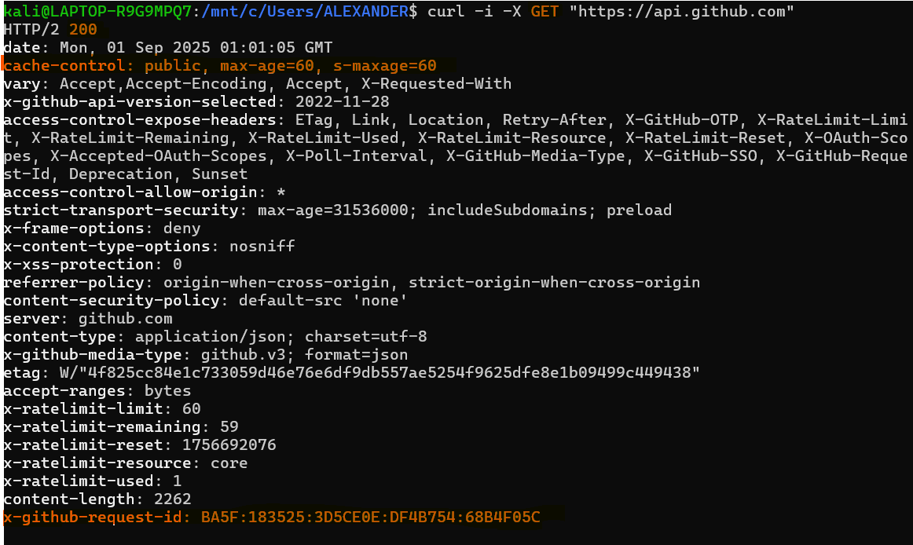
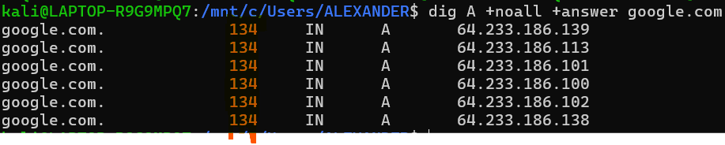
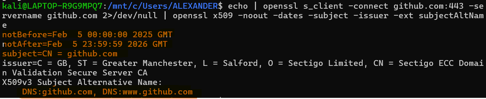
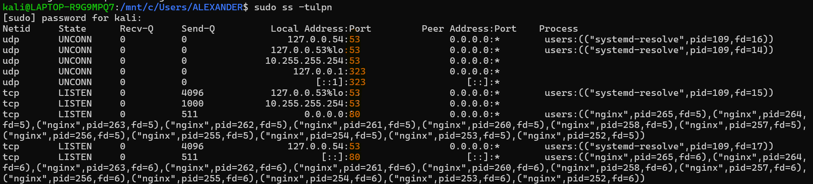
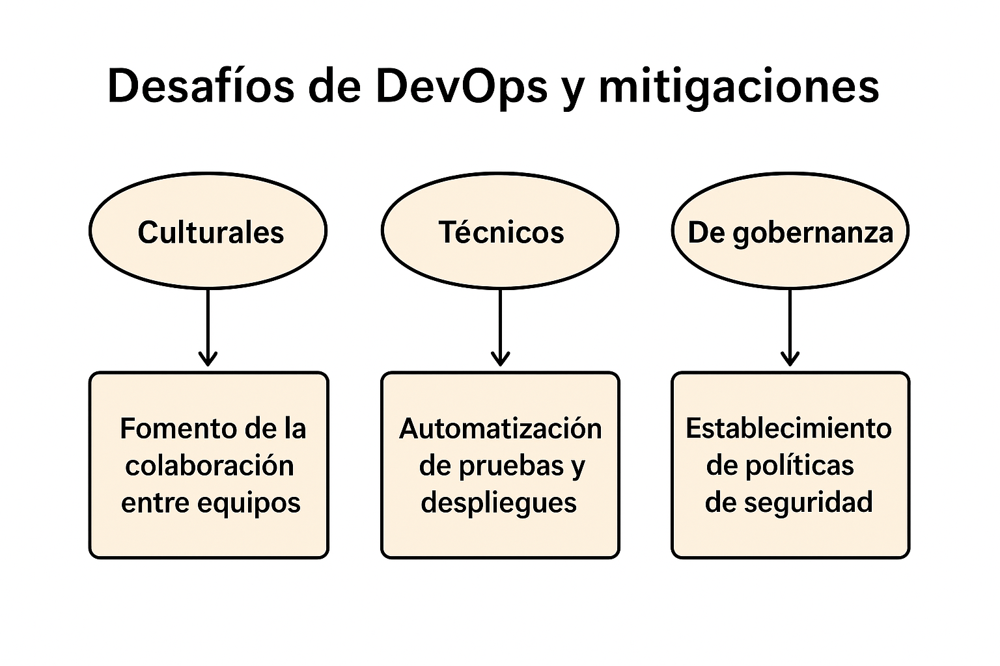
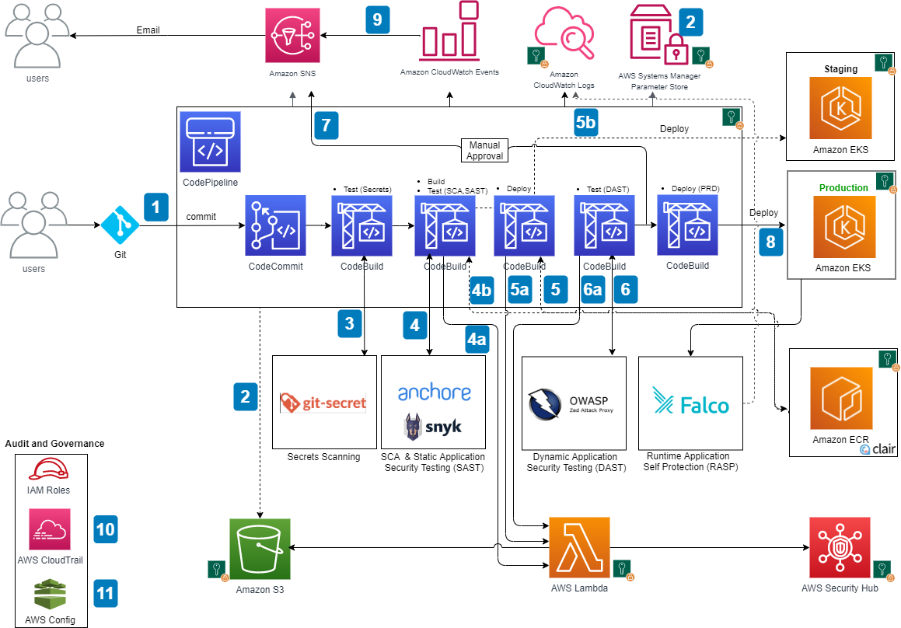

## DevOps vs Cascada
### Descripscion General

El modelo **Cascada**  es un enfoque tradicional para el desarrollo de software que se deriva de los procesos de ingeniería utilizados en proyectos militares a gran escala, como se describió originalmente por Royce en 1970. Este modelo organiza el desarrollo en una serie de fases secuenciales, donde cada fase debe completarse y aprobarse antes de pasar a la siguiente.
#### Fases del modelo en cascada

1.**Análisis y definición de requisitos** Se colabora con los usuarios del sistema para identificar los servicios que el sistema debe ofrecer, las restricciones y los objetivos del proyecto
2.**Diseño del sistema y del software** Se decide cómo los requisitos se implementarán en hardware o software. Se crea una arquitectura general del sistema, que describe los componentes principales y cómo interactúan. Luego, en el diseño de software, se identifican las abstracciones fundamentales y sus relaciones.
3.**Implementación y pruebas unitarias** El diseño se convierte en código, creando programas o unidades de programa cada unidad se prueba individualmente para verificar que cumple con su especificación.
4.**Integración y pruebas del sistema** Todas las unidades de programa se combinan para formar el sistema completo, que se prueba para asegurar que cumple con los requisitos definidos. Una vez que las pruebas son exitosas, el sistema se entrega al cliente.
5.**Operación y mantenimiento** Es la fase más larga del ciclo de vida. El sistema se implementa en un entorno real y se usa. El mantenimiento incluye corregir errores no detectados, mejorar el código y agregar nuevas funcionalidades según surjan necesidades

El término **DevOps** describe un movimiento cultural y técnico que busca transformar cómo las personas y las organizaciones desarrollan, entregan y mantienen software.Además, acelera la entrega de software mediante procesos intencionales y automatizados, mide el impacto de los cambios en el rendimiento organizacional y fomenta prácticas sostenibles para mantener un ritmo de trabajo eficiente.Facilita el intercambio de experiencias y el desarrollo de empatía, mejorando así las habilidades de los equipos de manera efectiva.
#### Los cuatro pilares de un DevOps eficaz
Los cuatro pilares que son esenciales para implementar DevOps de manera efectiva, abordando tanto los aspectos culturales como técnicos:
1.**Colaboracion** 
Es el proceso de trabajar juntos para lograr un objetivo común, involucrando a múltiples personas con diferentes roles

2.**Afinidad** 
Se refiere a construir relaciones sólidas entre equipos, departamentos y hasta organizaciones, fomentando empatía y objetivos compartidos.

3.**Herramientas** 
Las herramientas son tecnologías que aceleran los procesos de DevOps, como integración continua ,despliegue continuo o monitoreo.

4.**Escalabilidad** 
Se refiere a cómo los principios de DevOps se adaptan a organizaciones de diferentes tamaños,desde startups hasta grandes empresas, y a lo largo de su ciclo de vida crecimiento, madurez o reducción.

#### Por qué DevOps acelera y reduce riesgos en software para la nube frente al modelo en cascada
Mientras que el enfoque en cascada es secuencial, rígido y depende de procesos manuales, lo que retrasa las entregas y aumenta el riesgo de errores en entornos dinámicos como la nube, DevOps permite ciclos rápidos de retroalimentación, entregas incrementales y automatización de pruebas y despliegues. Esto facilita una adaptación ágil a cambios, reduce el impacto de fallos y acelera la generación de valor, alineándose con la necesidad de rapidez, escalabilidad y confiabilidad que exigen los entornos en la nube.
###  Contexto real donde un enfoque cercano a cascada sigue siendo razonable
En los sistemas de software para sistemas aeronauticos se encuentran bajo normativas como DO178C que requieren procesos altamente controlados, verificación documental exhaustiva y certificaciones previas a cada liberación.
En este entorno cada fase debe quedar cerrada revisada y documentada antes de continuar con la siguiente.El motivo es que un fallo en produccion no solo genera costos economicos , sino que puede comprometer la seguridad humana.

1.**Cumpliento estricto** 
Se exige evidencia de cada fase que ha sido ejecutada y verificada antes de seguir 
2.**Validacion del Software especifico** 
El software debe probarse debe probarse en entornos fisicos certificados(cabinas de simulacion y vuelos reales).
#### Trade-offs 
1.**Velocidad** 
Se sacrifica la rapidez en la entrega de nuevas versiones ya que cada modificacion implica repetir procesos de certificacion y validar costos
2.**Conformidad/Seguridad** 
Se garantiza que el producto cumple estrictamente la regulaciones y ofrece un alto nivel de confiabilidad , reduciendo el riesgo de fallos .

## Ciclo tradicional de dos pasos y silos (limitaciones y anti-patrones)

### Descripscion General
El **Ciclo Tradicional de dos pasos** es un proceso en 2 fases separadas:construccion(diseño,desarollo,pruebas unitarios) y operacion(despliegue , mantenimiento).Bajo esta lógica, los equipos de desarrollo entregaban un producto terminado al área de operaciones, que debía ejecutarlo y mantenerlo en producción. Esta dinámica generaba una mentalidad de handoffs (transferencias) donde el conocimiento se pasaba de un equipo a otro como si fuera un paquete cerrado, sin retroalimentación continua.
#### Limitaciones principales del ciclo “construcción → operación”
1.**Grandes lotes de cambios:**Al no existir integración continua, el código se fusionaba después de largos periodos de tiempo. Esto provocaba que los cambios se acumularan, aumentando la complejidad de las integraciones y dificultando encontrar la causa de un fallo.
2.**Colas de defectos y baja visibilidad:**Cuando el producto pasaba de desarrollo a operaciones, los errores acumulados se convertían en una “cola” de incidentes que debía resolverse bajo presión. En un esquema sin automatización de pruebas ni feedback temprano, los defectos se descubrían tarde, aumentando retrabajos, degradaciones repetitivas y un mayor MTTR (Mean Time to Recovery).

### Silos organizacinales

Un silo departamental u organizacional describe la mentalidad de los equipos que no comparten su conocimiento con otros equipos de la misma empresa. En lugar de tener objetivos o responsabilidades comunes, los equipos en silos tienen roles muy distintos y segregados. 
A menudo, en un entorno de silos, se encontrarán equipos diferentes utilizando herramientas o procesos completamente distintos para completar tareas similares, personas que tienen que subir varios niveles en la cadena de mando gerencial para obtener recursos o información de personas en otro equipo, y una buena cantidad de "pasar la pelota", es decir, transferir la culpa, la responsabilidad o el trabajo a otro equipo.
Tener silos para desarrolladores de software y administradores de sistemas o ingenieros de operaciones, y tratar de solucionar los problemas en el proceso de desarrollo de software que surgieron de ese entorno, fue una gran parte del origen del movimiento devops. Sin embargo, es importante señalar que esos no son los únicos silos que pueden existir en una organización. Los equipos multifuncionales a menudo son promocionados como los anti-silos, pero estas no son las dos únicas opciones, y el hecho de que un equipo cumpla una sola función no necesariamente lo convierte en un silo. Los silos surgen de la falta de comunicación y colaboración entre equipos, no simplemente de una separación de duties.
Los silos también favorecen una cultura de culpa. En la “visión antigua” del error humano se busca señalar responsables individuales en lugar de entender los problemas como síntomas de fallas sistémicas. Esta mentalidad no solo desalienta la colaboración, sino que también perpetúa prácticas defensivas como ocultar información o retrasar decisiones.
## Anti-patrones frecuentes:
1.**Throw over the wall :** El traspaso del software como una caja negra entre desarrollo y operaciones. Este anti-patrón aumenta la probabilidad de fallas en producción y dificulta la resolución rápida de incidentes, ya que cada equipo posee solo una parte del conocimiento necesario.
2.**Seguridad como auditoria tardia:** Cuando la seguridad se incorpora solo al final del ciclo, funciona más como una barrera que como un socio estratégico. Esto genera retrabajos y ralentiza despliegues, a la vez que deja vulnerabilidades sin detectar durante gran parte del proceso.

## Principios y beneficios de DevOps (CI/CD, automatización, colaboración; Agile como precursor)

### Implementación de la CI (Integración Continua)
1.**Integrarse con frecuencia**
El principio central de la integración continua es integrar cambios en la rama principal varias veces al día. Esto evita grandes lotes de código difíciles de fusionar y reduce riesgos de conflictos. Cambios más pequeños son más fáciles de probar, revertir y refactorizar. Además, mantener una versión estable y reciente del software permite retroceder rápidamente en caso de error y fomenta una cultura de exploración sin temor a romper la compilación.
2.**Tamaño de Cambios**
La integración frecuente conduce a cambios pequeños y manejables. Esto no solo facilita la revisión y el despliegue, sino que reduce la probabilidad de introducir errores complejos. Los cambios grandes y en ramas largas suelen producir handoffs costosos y retrasos por integración tardía, mientras que los cambios pequeños favorecen ciclos rápidos de feedback y menos retrabajo.
3.**Pruebas Automatizadas Cercanas al codigo**
Una compilación “exitosa” no basta: se necesitan pruebas automatizadas que acompañen cada integración. 
-**Unitarias** : rápidas, sobre métodos o funciones aisladas.

-**De componentes** : verifican interacciones entre subsistemas (p. ej. acceso a DB simulado).

-**De aceptación** : validan que el software cumple requisitos del negocio en un entorno realista.
Ejecutar siempre estas pruebas antes de integrar garantiza que cada cambio preserve la funcionalidad existente y mantenga la compilación en verde.

4.**Colaboracion**
 La CI no es solo técnica, también es colaboración disciplinada. En equipos distribuidos, mantener un repositorio compartido y pipelines accesibles es esencial. La comunicación abierta (chat, VoIP, videollamadas) ayuda a reducir las asimetrías de información y evita retrasos cuando alguien rompe la compilación. Herramientas como pretested commit o personal builds ayudan a mantener fluidez, pero el factor humano (confianza, responsabilidad compartida) es lo que sostiene la práctica.

### Implementación de la CD (Entrega Continua)

1.**Tamaño de Cambios**
Cada cambio debe propagarse por el pipeline de manera inmediata, etapa por etapa, en lugar de esperar a horarios fijos. Esto evita retrasos acumulados y asegura que los problemas se detecten cerca del cambio que los causó.
2.**Pruebas Automatizadas Cercanas al codigo**
Las pruebas de aceptación automatizadas son la “puerta” clave: validan que el sistema cumple criterios de aceptación y sirven como regresión. Estas pruebas deben ejecutarse automáticamente en un entorno similar al de producción y abarcar tanto aspectos funcionales como no funcionales (rendimiento, capacidad, escalado). Mantenerlas dentro del pipeline permite descubrir regresiones, problemas intermitentes y fallos difíciles de reproducir antes de llegar a producción.
3.**Colaboracion**
El pipeline de despliegue y las pruebas de aceptación forman parte del trabajo de equipos multifuncionales: desarrolladores, testers y clientes colaboran en su creación y mantenimiento. Ante fallos, el equipo debe reaccionar inmediatamente, distinguiendo entre regresiones, cambios intencionales o problemas en la prueba. Además, desplegar siempre con el mismo proceso en todos los entornos (dev, prueba, producción) reduce errores y fortalece la confianza en el flujo.
### Explicación de cómo una práctica Agile alimenta decisiones del pipeline
En las reuniones diarias, el equipo puede discutir directamente los problemas en la etapa de confirmación. Si los scripts de compilación se vuelven lentos, difíciles de mantener o empiezan a fallar, los desarrolladores y personal de operaciones identifican rápidamente el bloqueo. Esto conecta con la práctica de “detener la línea si alguna parte del pipeline falla”: cualquier fallo detectado se vuelve prioridad inmediata. Así,la decisión de bloquear la promoción del código hasta que la compilación y las pruebas unitarias pasen.
En las retrospectivas, el equipo reflexiona sobre la calidad y diseño de los scripts de confirmación. Al ver si estos han generado desperdicio de recursos  o han limitado la participación de los desarrolladores, se decide mejorar la modularidad, evitar configuraciones específicas de entorno y fomentar la propiedad del pipeline por todo el equipo. Esto influye en qué cambios se promueven: solo aquellos que respetan la estructura modular y son mantenibles. Los que no cumplen con estos criterios quedan bloqueados para no comprometer la productividad futura.
## Propuesta de un indicador observable (no financiero) y validez
### Proporción de reversiones de despliegue realizadas sin generar tiempo de inactividad.
### Validez del indicador
Este indicador refleja de manera directa la efectividad de la colaboración entre equipos Dev y Ops, ya que para lograr reversiones limpias y rápidas se necesita coordinación en prácticas de despliegue, respaldo de datos, y automatización compartida.
### Cómo recolectar
1.**Registros de despliegue (logs):**
Se puede configurar que cada despliegue y cada reversión quede registrado en archivos de log.
2.**Bitácoras del equipo (manuales o en wiki interna):**
Basta con mantener un archivo de texto plano en el servidor donde se añada automáticamente la entrada en cada despliegue.
## Evolución a DevSecOps (seguridad desde el inicio: SAST/DAST; cambio cultural)

### Diferencia SAST (estático, temprano) y DAST (dinámico, en ejecución), y ubícalos en el pipeline.
#### SAST (Pruebas de Seguridad de Aplicaciones Estáticas)
1.**Caracteristica:**Analiza el código estático de las aplicaciones (como código fuente, código de bytes y código binario) sin ejecutarlo, detectando condiciones que indican vulnerabilidades.
2.**Momento:**Se realiza en una etapa temprana, durante el desarrollo, lo que permite identificar problemas antes de que el código se ejecute.
3.**Beneficio:**Detecta vulnerabilidades del código en una fase inicial, ofreciendo una evaluación continua durante el desarrollo.

#### DAST (Pruebas de Seguridad de Aplicaciones Dinámicas)
1.**Caracteristica:**Analiza dinámicamente una aplicación en ejecución, identificando vulnerabilidades en tiempo real y problemas relacionados con el entorno.
2.**Momento:**Se aplica mientras la aplicación está corriendo, permitiendo detectar issues durante la ejecución y bajo ciertas condiciones del entorno.
3.**Beneficio:**Identifica y soluciona problemas durante la integración continua, enfocándose en vulnerabilidades dinámicas.
#### Ubicacion
**SAST:**
**Etapa:** Se ubica en la etapa de desarrollo, según la Tabla 10: Actividades de la Fase de Pruebas. Esto se alinea con su rol de analizar código estático temprano, como se menciona en el texto.
**Contexto:** Ocurre junto con las pruebas unitarias, antes de que el código avance a etapas posteriores, apoyando la detección temprana de vulnerabilidades.
**DAST:** 
**Etapa:** Se sitúa en la etapa de prueba del sistema, según la Tabla 10. Esto refleja su enfoque en analizar la aplicación en ejecución, junto con pruebas de integración y del sistema.
**Contexto:** Se realiza cuando la aplicación está operativa, permitiendo evaluar problemas en tiempo real durante la integración continua.
### Gate mínimo de seguridad con dos umbrales cuantitativos
Un **gate mínimo** de seguridad se puede definir como un punto de control en el proceso de liberación y entrega que evalúa los artefactos antes de su promoción a producción, asegurando que cumplan con criterios de seguridad establecidos. Este gate se alinea con las actividades de auditoría de configuración, decisión de liberación  y los resultados de pruebas y escaneos de seguridad mencionados. Se proponen **dos umbrales** cuantitativos:
Umbral 1:Bloqueo por Hallazgos Críticos
"Cualquier hallazgo crítico en componentes expuestos bloquea la promoción" significa que si se encuentra una vulnerabilidad de seguridad GRAVE en partes visibles del sistema (como APIs o interfaces web), el código NO puede avanzar a producción.
Umbral 2:Cobertura Mínima de Pruebas del 80%
Se requiere que al menos el 80% de los componentes del artefacto (e.g., binarios, imágenes de contenedores, scripts) estén cubiertos por pruebas de seguridad automatizadas (como las mencionadas en etapas de desarrollo, prueba del sistema o pre-producción) antes de la promoción. Esto incluye pruebas de integración, regresión y seguridad manuales donde aplique.
### Política de excepción con caducidad,
Una excepción se permite cuando un artefacto no cumple con los umbrales cuantitativos del gate mínimo de seguridad (e.g., hallazgos críticos en componentes expuestos o cobertura de pruebas de seguridad inferior al 80%), pero se justifica por una necesidad operativa crítica (e.g., despliegue urgente en una región remota). Esta política establece una fecha límite específica, un dueño responsable y un plan de corrección para mitigar riesgos de manera controlada.
**Fecha Límite:** Cada excepción tendrá un plazo de 5 días hábiles para corrección.La fecha límite asegura que el riesgo se limite temporalmente, alineándose con la necesidad de "despliegues rápidos y confiables" y la replicación controlada a repositorios regionales.Al alcanzar la fecha límite, se realiza una auditoría automática para verificar el cumplimiento, y el dueño recibe una notificación para retirar el artefacto si no se resuelve
**Dueño:**El Líder de Seguridad y Liberación del equipo DevSecOps una persona designada con experiencia en seguridad y configuración  será el responsable único de autorizar y gestionar la excepción. Esta figura garantiza trazabilidad y responsabilidad al evaluar riesgos, aprobar la solicitud, supervisar el plan de corrección y reportar el estado a la gerencia antes de la fecha límite establecida.
**Plan de Corrección:**El plan de corrección debe detallar de manera estructurada: la identificación específica del umbral incumplido (ej: "hallazgo crítico en API expuesta"), las acciones correctivas con fechas concretas, los recursos asignados (equipos y herramientas) .Esta planificación rigurosa justificada por la dependencia de los informes de seguridad que será supervisada por el Dueño mediante auditorías diarias y actualizaciones de los informes de configuración hasta su resolución o vencimiento del plazo.
### Pregunta Retadora
El "teatro de seguridad" ocurre cuando se cumplen checklists regulatorios de manera superficial, sin abordar riesgos reales como amenazas persistentes o vulnerabilidades dinámicas. Para evitarlo, basado en el texto, se debe implementar un enfoque proactivo y continuo que integre monitoreo dinámico, análisis inteligente y respuesta automatizada. 
1.**Adoptar monitoreo continuo integral**En lugar de checklists estáticos, implementa escaneos periódicos, inventario continuo de activos y detección de desviaciones, lo que asegura que el cumplimiento se base en datos reales del sistema en ejecución, no solo en auditorías puntuales.
2.**Usar análisis de logs y alertas automatizadas:**A través de herramientas filtra y correlaciona eventos para detectar actividades maliciosas o anomalías. Esto va más allá de checklists al generar alertas proactivas y flujos de trabajo automáticos para remediación, reduciendo riesgos reales como amenazas avanzadas.
3.**Auditoría y monitoreo de configuración continua:**Usa herramientas para verificar cumplimiento en tiempo real, detectando personal, conexiones o software no autorizados. Esto evita checklists "de una vez" al requerir evaluaciones continuas y acciones recomendadas.
#### Dos señales de eficacia:
Para verificar que la seguridad es efectiva y no solo "teatro", las siguientes señales de eficacia, resaltan métricas de desempeño, alertas y remediación:
1.**Disminución de hallazgos repetidos:**Mide la reducción porcentual de vulnerabilidades o incumplimientos recurrentes en informes sucesivos, reflejando la efectividad de las medidas correctivas para resolver problemas de raíz. Se calcula comparando históricos de reportes
2.**Reducción en tiempo de remediación:**Mide el tiempo desde la detección de una alerta  hasta su resolución, reflejando una respuesta rápida que reduce exposición a riesgos.Para calcularla, se registran automáticamente los timestamps de las entradas  y las salidas . Su implementación óptima utiliza agregadores de logs para extraer datos de forma automatizada y dashboards para visualizar tendencias 
## CI/CD y estrategias de despliegue 

### Elección de una estrategia para un microservicio crítico
Para un microservicio crítico como la autenticación, que es fundamental para la seguridad y el acceso al sistema, la estrategia de implementaciones Blue-Green es la más adecuada.Utiliza dos entornos idénticos (azul y verde), donde uno actúa como producción mientras el otro se prepara para una nueva versión. La transición entre entornos se realiza en menos de un segundo mediante un cambio en la configuración del enrutador, permitiendo reversiones instantáneas si algo falla.
1.**Reversión Instantánea:** Permite volver al entorno estable (verde) de forma inmediata si se detecta un fallo en la nueva versión (azul), evitando tiempos de inactividad y minimizando el impacto en los usuarios.

2.**Preparación y Pruebas Aisladas:** Facilita la actualización y prueba independiente de recursos compartidos críticos (como bases de datos) en el entorno azul, incluyendo migraciones de datos y pruebas de humo, sin afectar la producción activa.

3.**Práctica y Confiabilidad:** El entorno azul sirve como un espacio perfecto para practicar y validar el plan de reversión y las copias de seguridad, garantizando que el proceso de volver al entorno verde sea rápido, confiable y sin sorpresas.
### Tabla breve de riesgos vs. mitigaciones

|Riesgos|Mitigaciones|
|-------|------------|
|Regresión funcional|Validación de contrato antes de promover, utilizando un conjunto de pruebas automatizadas en el servidor de integración continua. |
|Costo operativo del doble despliegue|Establecer límites de tiempo de convivencia para minimizar recursos duplicados durante implementaciones Blue-Green.|
|Manejo de sesiones|Implementar sesiones y asegurar compatibilidad de esquemas de base de datos antes de la transición.|
|Retraso en entrega de código|Supervisar el progreso de proveedores externos con revisiones semanales y planificar ajustes anticipados si se detecta demora|
|Fallo instantáneo por capacidad|Realizar pruebas de capacidad automatizadas en el entorno de producción antes de la implementación, ajustando recursos según métricas.|
|Problemas en migración de datos|Realizar copias de seguridad del estado de la base de datos antes de cada versión y practicar la restauración en un entorno de prueba.|

### Un KPI primario y un umbral numérico con ventana de observación para promoción/abortado.
Un **KPI primario**(Indicador Clave de Desempeño Primario) es una métrica específica y crítica que se utiliza para evaluar el rendimiento o el éxito de un proceso, sistema o proyecto en relación con sus objetivos principales.

**-KPI primario:**(Latencia p95) Mide el tiempo de respuesta para el 95% de las transacciones, capturando tendencias y valores absolutos bajo carga, como se sugiere para escenarios con cargas variables y pruebas representativas.
**-Umbral numérico:**(Latencia p95 ≤ 500 ms) Ajustado por encima del mínimo aceptable para evitar fallos intermitentes por factores externos como red, pero lo suficientemente estricto para detectar degradaciones reales, similar a cómo el texto recomienda elevar el umbral tras superar un nivel mínimo para proteger contra cambios involuntarios.
**-Ventana de observación:**(5 minutos)Período para recopilar mediciones estables y reproducibles, permitiendo análisis de tendencias sin ser tan largo como para introducir variables impredecibles, alineado con el enfoque de pruebas cortas como 30 segundos.

**Criterios para la promocion/abortado**
-**Promoción:** Si la latencia ≤500 ms durante la ventana de 5 minutos, promover la versión, ya que indica resultados estables y capacidad adecuada.
-**Abortado:** Si la latencia excede 500 ms en cualquier punto de la ventana, abortar y revertir, para posponer problemas difíciles  y evitar fallos intermitentes o falsos negativos, ajustando el umbral si es necesario tras análisis humano.
### Pregunta Retadora:Si el KPI técnico se mantiene, pero cae una métrica de producto (conversión) explica por qué ambos tipos de métricas deben coexistir en el gate.
Ambos tipos de métricas (KPI técnico y métrica de producto) deben coexistir en el gate de implementación porque miden dimensiones complementarias del éxito que, por sí solas, son insuficientes para garantizar un lanzamiento exitoso. Si el KPI técnico se mantiene (ej: latencia estable) pero la métrica de producto cae (ej: conversión), abortar la implementación es crucial por estas razones:
1.**Evita optimizaciones locales en lugar de globales:**
Un KPI técnico (ej: latencia) mide la eficiencia del sistema, pero no captura si el cambio perjudicó la experiencia del usuario o el valor del negocio. La métrica de producto (ej: conversión) asegura que no se optimice solo el rendimiento técnico ignorando el impacto real en los usuarios.
2.**Equilibra el comportamiento del equipo**
Si solo se miden métricas técnicas, el equipo se enfocará exclusivamente en ellas.Incluir métricas de producto incentiva al equipo a priorizar tanto la estabilidad técnica como los resultados de negocio.
3.**Facilita la toma de decisiones visual e integral**
Permite identificar rápidamente problemas que requieren abortar la implementación, alineando a técnicos y gestores en la prioridad: entregar valor sin degradar la experiencia.
## Fundamentos prácticos
### 1.**HTTP-contrato observable:**

Realicé un experimento comprobando un endpoint HTTP probé con https://api.github.com, obteniendo los siguientes detalles:

**Método**: GET (método estándar para recuperar recursos).
**Código de estado:** 200 (indica que la solicitud fue exitosa y el recurso está disponible).
**Cache-Control**: public, max-age=60, s-maxage=60 (instruye al cliente y proxies a cachear la respuesta por 60 segundos).
**X-GitHub-Request-Id**: BA5F:183525:3D5CE0E:DF4B754:68B4F05C (un identificador único para rastrear la solicitud a través del sistema).
#### Influencia de las cabeceras
**Cache-Control:** Esta cabecera influye en el rendimiento y la caché al permitir que los clientes y proxies almacenen localmente la respuesta durante 60 segundos. Esto reduce la latencia al evitar solicitudes repetidas al servidor, disminuye la carga en el sistema y mejora la experiencia del usuario al servir contenido más rápidamente desde el caché. Sin embargo, un valor bajo como 60 segundos asegura que las actualizaciones se propaguen rápidamente, evitando retrasos en contenido dinámico.
### 2.**DNS - nombres y TTL:**

Realicé una comprobación de un dominio estándar utilizando la herramienta dig. Ejecuté el comando dig A +noall +answer google.com obteniendo los siguientes detalles:

**Tipo de registro:** A (indica direcciones IP directas asociadas al dominio google.com).
**TTL:** 134 segundos (tiempo de vida de la caché establecido para cada registro A).
El TTL afecta directamente los rollbacks y los cambios de IP debido a su rol en la propagación y las ventanas de inconsistencia. Un TTL bajo, como los 134 segundos reportados, indica que los resolvers DNS (servidores recursivos) almacenan la información del registro por un período corto antes de consultar nuevamente al servidor autoritativo. Esto tiene las siguientes implicaciones:
**Propagación:** Un TTL bajo acelera la propagación de cambios de IP (e.g., al realizar un rollback o actualizar una dirección). Por ejemplo, tras un cambio, los resolvers actualizarán la IP en aproximadamente 2-3 minutos, minimizando el tiempo que los usuarios ven la IP antigua.
**Ventanas de inconsistencia:** Sin embargo, un TTL bajo también crea ventanas de inconsistencia más frecuentes, ya que los resolvers no siempre consultan al mismo tiempo. Durante un rollback, algunos usuarios podrían seguir resolviendo una IP antigua hasta que su caché local expire, lo que puede generar accesos erráticos por hasta 134 segundos. Un TTL más alto (e.g., 3600s) extendería esta ventana, complicando rollbacks rápidos, mientras que un valor muy bajo podría sobrecargar el servidor autoritativo con consultas constantes.
### 3.**TLS - seguridad en tránsito**

Realicé una comprobación del certificado TLS del sitio seguro github.com utilizando la herramienta openssl. Los detalles obtenidos son los siguientes:
**CN/SAN:** CN = github.com, SAN incluye github.com y www.github.com (nombres de dominio y alternativos cubiertos por el certificado).
**Vigencia:** Desde Feb 5 00:00:00 2025 GMT hasta Feb 5 23:59:59 2026 GMT.
**Emisora:** Sectigo Limited (autoridad de certificación que emitió el certificado, con detalles C = GB, ST = Greater Manchester, L = Salford, O = Sectigo Limited, CN = Sectigo ECC Domain Validation Secure Server CA).
Si no se valida correctamente la cadena de certificados (e.g., por caducidad, emisora no confiable o mismatch de CN/SAN), ocurren los siguientes problemas:
**Errores de confianza:** El navegador o cliente mostrará advertencias (e.g., "Conexión no segura") porque no puede establecer una cadena de confianza hasta una autoridad raíz conocida, lo que indica que el certificado no es válido o no se puede verificar.
**Riesgo de MITM (Man-in-the-Middle):** Un atacante podría interceptar la comunicación al presentar un certificado falso, especialmente si la cadena no se valida, permitiendo robo de datos sensibles como credenciales o contenido privado.
**Impacto en UX (experiencia de usuario):** Los usuarios enfrentan interrupciones  y pueden abandonar el sitio por desconfianza, reduciendo la retención y afectando la reputación del servicio. 
### 4.**Puertos - estado de runtime:**

Realicé una comprobación de los puertos en escucha en mi máquina utilizando el comando sudo ss -tulpn. Los detalles obtenidos son los siguientes:
Puertos en escucha:
**Puerto 80** (asociado a múltiples instancias de nginx, sugiriendo un servidor web HTTP).
**Puerto 53** (asociado a systemd-resolve, sugiriendo un servidor DNS local).

Esta evidencia ayuda a detectar:

**Despliegues incompletos:** Si el puerto 80 no aparece en escucha, indica un despliegue fallido, impidiendo el acceso al servicio web. De manera similar, la ausencia del puerto 53 podría señalar un fallo en la resolución DNS local.
**Conflictos:** Si el puerto 80 está ocupado por otro proceso, causaría un conflicto, haciendo que nginx falle al iniciar. Para el puerto 53, un conflicto con otro servicio DNS  podría generar fallos en la resolución, requiriendo resolución manual.

### 5.**12-Factor - port binding, configuración, logs:**
En una aplicación 12-Factor, el puerto se parametriza mediante variables de entorno externas.La aplicación lee esta variable al iniciar y se une dinámicamente al puerto especificado. Esto permite que el entorno asigne el puerto sin modificar el código fuente, asegurando portabilidad entre entornos como desarrollo, pruebas y producción.
**Dónde verías los logs en ejecución (flujo estándar) y por qué no deberías escribirlos en archivos locales rotados a mano**
Los logs se ven en el flujo estándar capturados por el entorno de ejecución . No se deberían escribir en archivos locales rotados a mano porque esto viola la reproducibilidad y escalabilidad: archivos locales se pierden en reinicios o escalados, requieren gestión manual y complican la agregación en entornos distribuidos; en cambio, flujos estándar permiten centralizar logs con herramientas externas.
**Anti-patrón señalado y su impacto en reproducibilidad**
Un anti-patrón es incluir credenciales directamente en el código fuente. Su impacto en reproducibilidad es negativo porque acopla secretos al build, haciendo que cada entorno requiera cambios en el código  lo que impide ejecuciones idénticas entre dev, test y prod. Esto también expone riesgos de seguridad al versionar credenciales en repositorios.

### 6.**Checklist de diagnóstico (incidente simulado):**
**Paso 1:** Discriminar resolución DNS inconsistente (b). El objetivo es verificar la estabilidad del registro DNS. La evidencia esperada es un registro A estable con TTL bajo (e.g., ≤300s) y la misma IP en consultas repetidas. La interpretación es que si el TTL es mayor a 3600s o las IPs varían, la DNS inconsistente causa intermitencia por propagación lenta. La acción siguiente es que si es inconsistente, abortado: ajustar TTL y reprobar; si OK, pasar a 2.
**Paso 2:** Discriminar certificado TLS caducado/incorrecto (c). El objetivo es confirmar la validez del certificado. La evidencia esperada es una vigencia actual (e.g., notAfter > fecha actual) y un CN/SAN coincidente con el dominio. La interpretación es que si el certificado está caducado o hay un mismatch, los errores de confianza causan intermitencia por rechazos de conexión. La acción siguiente es que si es incorrecto, abortado: renovar cert; si OK, pasar a 3.
**Paso 3:** Discriminar puerto mal configurado/no expuesto (d). El objetivo es asegurar que el puerto esté en escucha. La evidencia esperada es un puerto esperado en escucha (e.g., 443 para HTTPS) sin conflictos. La interpretación es que si el puerto no está expuesto o está ocupado, las conexiones fallan intermitentemente por bloqueo. La acción siguiente es que si está mal configurado, abortado: exponer puerto; si OK, pasar a 4.
**Paso 4:** Discriminar contrato HTTP roto (a). El objetivo es validar el contrato HTTP. La evidencia esperada es un código 200 con cabeceras válidas (e.g., Cache-Control presente). La interpretación es que si el código es diferente a 200 (e.g., 500), el HTTP roto causa intermitencia por respuestas fallidas. La acción siguiente es que si está roto, abortado: corregir endpoint; si OK, pasar a 5.
**Paso 5:** Verificar integración DNS-TLS. El objetivo es confirmar la compatibilidad entre DNS y TLS. La evidencia esperada es que la resolución DNS lleve a un TLS válido sin errores de cadena. La interpretación es que si la integración falla (e.g., DNS resuelve pero TLS rechaza), hay una causa combinada de inconsistencia. La acción siguiente es que si falla, abortado: revisar cadena; si OK, pasar a 6.
**Paso 6:** Confirmar puerto-HTTP. El objetivo es validar la funcionalidad completa. La evidencia esperada es que el puerto expuesto responda con HTTP 200 sin intermitencia. La interpretación es que si no se resuelve, la causa combinada persiste. La acción siguiente es que si falla, escalar a equipo; si OK, incidente resuelto.
## Desafíos de DevOps y mitigaciones

### Riesgos y mitigaciones (tabla)
|Riesgo |Mitigación concreta|
|-------|---------------------|
|Regresión funcional en producción| Validación de contrato + despliegues graduales (canary): ejecutar tests de contrato y pruebas de aceptación automáticas en pipeline; desplegar a canary con ventanas de observación; bloquear promoción si falla el contrato.|
|Blast radius / impacto amplio|Límites de blast radius + feature flags: desplegar primero a segmentos pequeños y usar feature flags para desactivar nuevas funcionalidades instantáneamente; tiempo máximo de convivencia del doble-deployment .|
|Problemas operativos por despliegue|Draining de sesiones + migraciones compatibles hacia atrás: aplicar "connection draining" en load balancer; usar migrations incrementales  |
### Experimento controlado: ¿Despliegue gradual (canary) reduce riesgo vs. big-bang?
Objetivo: validar empíricamente que despliegues graduales reducen incidentes y rollbacks frente a despliegues monolíticos (big-bang) para un microservicio crítico .
Se plantea un despliegue gradual frente a uno “big-bang” para validar reducción de riesgos.

1.**Métrica primaria:** tasa de error 5xx o latencia p95.

2.**Diseño:** un grupo de usuarios recibe el despliegue gradual (canary al 10–20%), mientras el grupo control sigue con la versión estable.

3.**Criterio de éxito:** la nueva versión no supera en más de un umbral definido (ej. +2% de errores o +50ms de latencia) respecto al control.

4.**Plan de reversión:** si el umbral se excede, se retira el canary y los usuarios vuelven a la versión estable inmediatamente.
## Arquitectura mínima para DevSecOps (HTTP/DNS/TLS + 12-Factor)

El flujo Cliente → DNS → Servicio (HTTP) → TLS se asegura mediante controles en cada capa. En la resolución de nombres (Cliente → DNS), un TTL razonable (60–300s) permite rollbacks rápidos y, opcionalmente, DNSSEC añade validación; esto contribuye a despliegues seguros al facilitar la conmutación controlada entre versiones y revertir cambios con baja ventana de inconsistencia. En la interacción DNS → Servicio (HTTP), los contratos de API (OpenAPI/CDC) previenen regresiones, las políticas de caché (Cache-Control, ETag, Vary) estabilizan el rendimiento, los límites de tasa y circuit breakers reducen el “blast radius” ante fallos, y las cabeceras de trazabilidad fortalecen la observabilidad. Finalmente, en la capa Servicio (HTTP) → TLS, la validación estricta de certificados, el uso de HSTS y protocolos seguros, junto con la rotación automatizada de certificados en el pipeline, garantizan seguridad en tránsito sin pasos manuales, evitando errores por caducidad y asegurando reproducibilidad gracias a configuraciones TLS versionadas que se despliegan de manera uniforme en todos los entornos.

### ¿Dónde aplicar cada control?
1.**DNS:** TTL, DNSSEC.
2.**Gateway/Proxy** (frontera HTTP): rate limiting, validación de contrato (schema check), políticas de caché/headers, trazas distribuidas.
3.**Servicio:** manejo de versiones de API (v1/v2, feature flags), respuestas con ETag, métricas de salud.
4.**Capa TLS/terminación:** certificados válidos, HSTS, automatización de emisión/renovación
### Contribución de cada capa a despliegues seguros y reproducibles
1.**DNS:** desacopla ubicación del servicio → rollouts/rollbacks previsibles mediante nombres; TTL controla la velocidad de propagación.
2.**HTTP/Contrato:** pruebas de contrato en CI impiden promover artefactos que rompen clientes; headers de caché hacen que la performance bajo canary sea comparable al estado estable.
3.**Rate limiting:** limita el impacto de una versión defectuosa (menor “blast radius”) y protege dependencias.
4.**TLS automatizado:** elimina errores manuales, homogeneiza configuración por entorno (misma receta de despliegue).