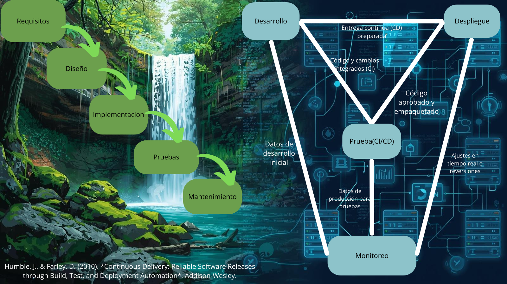

## DevOps vs Cascada
### Descripscion General

El modelo **Cascada**  es un enfoque tradicional para el desarrollo de software que se deriva de los procesos de ingeniería utilizados en proyectos militares a gran escala, como se describió originalmente por Royce en 1970. Este modelo organiza el desarrollo en una serie de fases secuenciales, donde cada fase debe completarse y aprobarse antes de pasar a la siguiente.
#### Fases del modelo en cascada

1.**Análisis y definición de requisitos** Se colabora con los usuarios del sistema para identificar los servicios que el sistema debe ofrecer, las restricciones y los objetivos del proyecto
2.**Diseño del sistema y del software** Se decide cómo los requisitos se implementarán en hardware o software. Se crea una arquitectura general del sistema, que describe los componentes principales y cómo interactúan. Luego, en el diseño de software, se identifican las abstracciones fundamentales y sus relaciones.
3.**Implementación y pruebas unitarias** El diseño se convierte en código, creando programas o unidades de programa cada unidad se prueba individualmente para verificar que cumple con su especificación.
4.**Integración y pruebas del sistema** Todas las unidades de programa se combinan para formar el sistema completo, que se prueba para asegurar que cumple con los requisitos definidos. Una vez que las pruebas son exitosas, el sistema se entrega al cliente.
5.**Operación y mantenimiento** Es la fase más larga del ciclo de vida. El sistema se implementa en un entorno real y se usa. El mantenimiento incluye corregir errores no detectados, mejorar el código y agregar nuevas funcionalidades según surjan necesidades

El término **DevOps** describe un movimiento cultural y técnico que busca transformar cómo las personas y las organizaciones desarrollan, entregan y mantienen software.Además, acelera la entrega de software mediante procesos intencionales y automatizados, mide el impacto de los cambios en el rendimiento organizacional y fomenta prácticas sostenibles para mantener un ritmo de trabajo eficiente.Facilita el intercambio de experiencias y el desarrollo de empatía, mejorando así las habilidades de los equipos de manera efectiva.
#### Los cuatro pilares de un DevOps eficaz
Los cuatro pilares que son esenciales para implementar DevOps de manera efectiva, abordando tanto los aspectos culturales como técnicos:
1.**Colaboracion** 
Es el proceso de trabajar juntos para lograr un objetivo común, involucrando a múltiples personas con diferentes roles

2.**Afinidad** 
Se refiere a construir relaciones sólidas entre equipos, departamentos y hasta organizaciones, fomentando empatía y objetivos compartidos.

3.**Herramientas** 
Las herramientas son tecnologías que aceleran los procesos de DevOps, como integración continua ,despliegue continuo o monitoreo.

4.**Escalabilidad** 
Se refiere a cómo los principios de DevOps se adaptan a organizaciones de diferentes tamaños,desde startups hasta grandes empresas, y a lo largo de su ciclo de vida crecimiento, madurez o reducción.

#### Por qué DevOps acelera y reduce riesgos en software para la nube frente al modelo en cascada
Mientras que el enfoque en cascada es secuencial, rígido y depende de procesos manuales, lo que retrasa las entregas y aumenta el riesgo de errores en entornos dinámicos como la nube, DevOps permite ciclos rápidos de retroalimentación, entregas incrementales y automatización de pruebas y despliegues. Esto facilita una adaptación ágil a cambios, reduce el impacto de fallos y acelera la generación de valor, alineándose con la necesidad de rapidez, escalabilidad y confiabilidad que exigen los entornos en la nube.
###  Contexto real donde un enfoque cercano a cascada sigue siendo razonable
En los sistemas de software para sistemas aeronauticos se encuentran bajo normativas como DO178C que requieren procesos altamente controlados, verificación documental exhaustiva y certificaciones previas a cada liberación.
En este entorno cada fase debe quedar cerrada revisada y documentada antes de continuar con la siguiente.El motivo es que un fallo en produccion no solo genera costos economicos , sino que puede comprometer la seguridad humana.

1.**Cumpliento estricto** 
Se exige evidencia de cada fase que ha sido ejecutada y verificada antes de seguir 
2.**Validacion del Software especifico** 
El software debe probarse debe probarse en entornos fisicos certificados(cabinas de simulacion y vuelos reales).
#### Trade-offs 
1.**Velocidad** 
Se sacrifica la rapidez en la entrega de nuevas versiones ya que cada modificacion implica repetir procesos de certificacion y validar costos
2.**Conformidad/Seguridad** 
Se garantiza que el producto cumple estrictamente la regulaciones y ofrece un alto nivel de confiabilidad , reduciendo el riesgo de fallos .

## Ciclo tradicional de dos pasos y silos (limitaciones y anti-patrones)

### Descripscion General
El **Ciclo Tradicional de dos pasos** es un proceso en 2 fases separadas:construccion(diseño,desarollo,pruebas unitarios) y operacion(despliegue , mantenimiento).Bajo esta lógica, los equipos de desarrollo entregaban un producto terminado al área de operaciones, que debía ejecutarlo y mantenerlo en producción. Esta dinámica generaba una mentalidad de handoffs (transferencias) donde el conocimiento se pasaba de un equipo a otro como si fuera un paquete cerrado, sin retroalimentación continua.
#### Limitaciones principales del ciclo “construcción → operación”
1.**Grandes lotes de cambios:**Al no existir integración continua, el código se fusionaba después de largos periodos de tiempo. Esto provocaba que los cambios se acumularan, aumentando la complejidad de las integraciones y dificultando encontrar la causa de un fallo.
2.**Colas de defectos y baja visibilidad:**Cuando el producto pasaba de desarrollo a operaciones, los errores acumulados se convertían en una “cola” de incidentes que debía resolverse bajo presión. En un esquema sin automatización de pruebas ni feedback temprano, los defectos se descubrían tarde, aumentando retrabajos, degradaciones repetitivas y un mayor MTTR (Mean Time to Recovery).

### Silos organizacinales

Un silo departamental u organizacional describe la mentalidad de los equipos que no comparten su conocimiento con otros equipos de la misma empresa. En lugar de tener objetivos o responsabilidades comunes, los equipos en silos tienen roles muy distintos y segregados. 
A menudo, en un entorno de silos, se encontrarán equipos diferentes utilizando herramientas o procesos completamente distintos para completar tareas similares, personas que tienen que subir varios niveles en la cadena de mando gerencial para obtener recursos o información de personas en otro equipo, y una buena cantidad de "pasar la pelota", es decir, transferir la culpa, la responsabilidad o el trabajo a otro equipo.
Tener silos para desarrolladores de software y administradores de sistemas o ingenieros de operaciones, y tratar de solucionar los problemas en el proceso de desarrollo de software que surgieron de ese entorno, fue una gran parte del origen del movimiento devops. Sin embargo, es importante señalar que esos no son los únicos silos que pueden existir en una organización. Los equipos multifuncionales a menudo son promocionados como los anti-silos, pero estas no son las dos únicas opciones, y el hecho de que un equipo cumpla una sola función no necesariamente lo convierte en un silo. Los silos surgen de la falta de comunicación y colaboración entre equipos, no simplemente de una separación de duties.
Los silos también favorecen una cultura de culpa. En la “visión antigua” del error humano se busca señalar responsables individuales en lugar de entender los problemas como síntomas de fallas sistémicas. Esta mentalidad no solo desalienta la colaboración, sino que también perpetúa prácticas defensivas como ocultar información o retrasar decisiones.
## Anti-patrones frecuentes:
1.**Throw over the wall :**El traspaso del software como una caja negra entre desarrollo y operaciones. Este anti-patrón aumenta la probabilidad de fallas en producción y dificulta la resolución rápida de incidentes, ya que cada equipo posee solo una parte del conocimiento necesario.
2.**Seguridad como auditoria tardia:**Cuando la seguridad se incorpora solo al final del ciclo, funciona más como una barrera que como un socio estratégico. Esto genera retrabajos y ralentiza despliegues, a la vez que deja vulnerabilidades sin detectar durante gran parte del proceso.

## Principios y beneficios de DevOps (CI/CD, automatización, colaboración; Agile como precursor)

### Implementación de la CI (Integración Continua)
1.**Integrarse con frecuencia**
El principio central de la integración continua es integrar cambios en la rama principal varias veces al día. Esto evita grandes lotes de código difíciles de fusionar y reduce riesgos de conflictos. Cambios más pequeños son más fáciles de probar, revertir y refactorizar. Además, mantener una versión estable y reciente del software permite retroceder rápidamente en caso de error y fomenta una cultura de exploración sin temor a romper la compilación.
2.**Tamaño de Cambios**
La integración frecuente conduce a cambios pequeños y manejables. Esto no solo facilita la revisión y el despliegue, sino que reduce la probabilidad de introducir errores complejos. Los cambios grandes y en ramas largas suelen producir handoffs costosos y retrasos por integración tardía, mientras que los cambios pequeños favorecen ciclos rápidos de feedback y menos retrabajo.
3.**Pruebas Automatizadas Cercanas al codigo**
Una compilación “exitosa” no basta: se necesitan pruebas automatizadas que acompañen cada integración. 
-**Unitarias** : rápidas, sobre métodos o funciones aisladas.

-**De componentes** : verifican interacciones entre subsistemas (p. ej. acceso a DB simulado).

-**De aceptación** : validan que el software cumple requisitos del negocio en un entorno realista.
Ejecutar siempre estas pruebas antes de integrar garantiza que cada cambio preserve la funcionalidad existente y mantenga la compilación en verde.

4.**Colaboracion**
 La CI no es solo técnica, también es colaboración disciplinada. En equipos distribuidos, mantener un repositorio compartido y pipelines accesibles es esencial. La comunicación abierta (chat, VoIP, videollamadas) ayuda a reducir las asimetrías de información y evita retrasos cuando alguien rompe la compilación. Herramientas como pretested commit o personal builds ayudan a mantener fluidez, pero el factor humano (confianza, responsabilidad compartida) es lo que sostiene la práctica.

### Implementación de la CD (Entrega Continua)

1.**Tamaño de Cambios**
Cada cambio debe propagarse por el pipeline de manera inmediata, etapa por etapa, en lugar de esperar a horarios fijos. Esto evita retrasos acumulados y asegura que los problemas se detecten cerca del cambio que los causó.
2.**Pruebas Automatizadas Cercanas al codigo**
Las pruebas de aceptación automatizadas son la “puerta” clave: validan que el sistema cumple criterios de aceptación y sirven como regresión. Estas pruebas deben ejecutarse automáticamente en un entorno similar al de producción y abarcar tanto aspectos funcionales como no funcionales (rendimiento, capacidad, escalado). Mantenerlas dentro del pipeline permite descubrir regresiones, problemas intermitentes y fallos difíciles de reproducir antes de llegar a producción.
3.**Colaboracion**
El pipeline de despliegue y las pruebas de aceptación forman parte del trabajo de equipos multifuncionales: desarrolladores, testers y clientes colaboran en su creación y mantenimiento. Ante fallos, el equipo debe reaccionar inmediatamente, distinguiendo entre regresiones, cambios intencionales o problemas en la prueba. Además, desplegar siempre con el mismo proceso en todos los entornos (dev, prueba, producción) reduce errores y fortalece la confianza en el flujo.
### Explicación de cómo una práctica Agile alimenta decisiones del pipeline
En las reuniones diarias, el equipo puede discutir directamente los problemas en la etapa de confirmación. Si los scripts de compilación se vuelven lentos, difíciles de mantener o empiezan a fallar, los desarrolladores y personal de operaciones identifican rápidamente el bloqueo. Esto conecta con la práctica de “detener la línea si alguna parte del pipeline falla”: cualquier fallo detectado se vuelve prioridad inmediata. Así,la decisión de bloquear la promoción del código hasta que la compilación y las pruebas unitarias pasen.
En las retrospectivas, el equipo reflexiona sobre la calidad y diseño de los scripts de confirmación. Al ver si estos han generado desperdicio de recursos  o han limitado la participación de los desarrolladores, se decide mejorar la modularidad, evitar configuraciones específicas de entorno y fomentar la propiedad del pipeline por todo el equipo. Esto influye en qué cambios se promueven: solo aquellos que respetan la estructura modular y son mantenibles. Los que no cumplen con estos criterios quedan bloqueados para no comprometer la productividad futura.
## Propuesta de un indicador observable (no financiero) y validez
### Proporción de reversiones de despliegue realizadas sin generar tiempo de inactividad.
### Validez del indicador
Este indicador refleja de manera directa la efectividad de la colaboración entre equipos Dev y Ops, ya que para lograr reversiones limpias y rápidas se necesita coordinación en prácticas de despliegue, respaldo de datos, y automatización compartida.
### Cómo recolectar
1.**Registros de despliegue (logs):**
Se puede configurar que cada despliegue y cada reversión quede registrado en archivos de log.
2.**Bitácoras del equipo (manuales o en wiki interna):**
Basta con mantener un archivo de texto plano en el servidor donde se añada automáticamente la entrada en cada despliegue.
