## HTTP: Fundamentos y herramientas
 **Activar el entorno virtual (venv):**
Para activar el entorno virtual se usa estos comandos:
**source .venv/bin/activate**
**pip install flask**

**Verificar** que se tenga los archivos **app.py y Makefile**
 **Levantar la aplicacion con variables de entorno**

PORT=8080 MESSAGE="Hola CC3S2" RELEASE="v1" python3 app.py

**Extracto de salida**
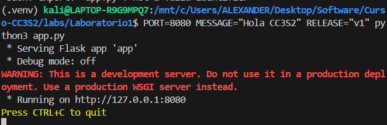

**Se prueba en el navegador**
http://127.0.0.1:8080
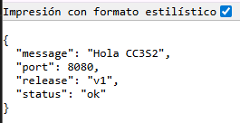

**Se ejecuto** :curl -v http://127.0.0.1:8080/
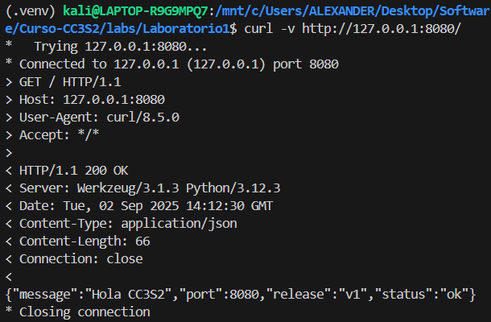

1. curl intenta conectarse al host 127.0.0.1 (localhost) en el puerto 8080 y lo logra.
2. Conexion Establecida:
3. Trying 127.0.0.1:8080...
4. Connected to 127.0.0.1 (127.0.0.1) port 8080

**Request enviado**
1. GET / HTTP/1.1 → petición HTTP de tipo GET al recurso raíz /.
2. Host: 127.0.0.1:8080 → indica el host y puerto destino.
3. User-Agent: curl/8.5.0 → el cliente que hace la petición (en este caso curl).
4. Accept: */* → el cliente acepta cualquier tipo de contenido en la respuesta.

**Respuesta del Servidor Flask**
1. HTTP/1.1 200 OK → el servidor responde con código 200, lo que significa éxito.
2. Server: Werkzeug/3.1.3 Python/3.12.3 → el servidor que está atendiendo (Flask usa Werkzeug).
3. Date: ... → fecha y hora de la respuesta.
4. Content-Type: application/json → el cuerpo viene en formato JSON.
5. Content-Length: 66 → la longitud (bytes) del cuerpo de la respuesta.
6. Connection: close → el servidor cierra la conexión tras enviar la respuesta.

**Se ejecuto** :curl -i -X POST http://127.0.0.1:8080/
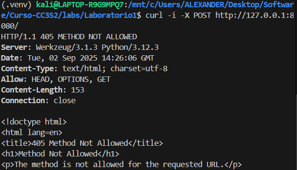

**Cabecera**
1. HTTP/1.1 405 METHOD NOT ALLOWED → el servidor recibió tu request pero rechaza el método POST.
2. Server: Werkzeug/3.1.3 Python/3.12.3 → Flask/Werkzeug atendiendo la request.
3. Content-Type: text/html → el cuerpo de la respuesta está en HTML (no JSON).
4. Allow: HEAD, OPTIONS, GET → el servidor te dice qué métodos sí están permitidos en esa ruta (GET, HEAD, OPTIONS).
5. Content-Length: 153 → tamaño del cuerpo.
6. Connection: close → la conexión se cierra después de responder.

**Qué campos de respuesta cambian si actualizas MESSAGE/RELEASE sin reiniciar el proceso**
Si cambias las variables de entorno MESSAGE o RELEASE en la consola sin reiniciar el servidor Flask, la respuesta de la aplicación no se actualiza, porque el proceso de Python tomó una copia de esas variables solo al momento de iniciarse. En sistemas tipo Unix, las variables de entorno se pasan al proceso al crearlo, y después ya no cambian aunque se modifiquen en el shell. Por eso, para que la app muestre los nuevos valores, necesitas reiniciarla con las variables actualizadas, lo que refleja el principio 12-Factor de que la configuración se define en el entorno al inicio de la ejecución.

**Se ejecuto** :ss -ltnp | grep :8080
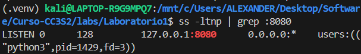
1. LISTEN indica que el puerto está abierto y esperando conexiones.
2. 127.0.0.1:8080 confirma que la aplicación está escuchando en localhost en el puerto 8080, definido por la variable de entorno PORT.
3. El proceso asociado es python3 (pid=1429), lo que confirma que es nuestra app Flask.
4. Esto demuestra el principio Port Binding: la aplicación expone su servicio vía un puerto y no depende de un servidor externo.

**Logs como flujo**
[INFO] GET /  message=Hola CC3S2 release=v1
127.0.0.1 - - [02/Sep/2025 09:08:19] "GET / HTTP/1.1" 200 -        
127.0.0.1 - - [02/Sep/2025 09:08:20] "GET /favicon.ico HTTP/1.1" 404 -
[INFO] GET /  message=Hola CC3S2 release=v1
127.0.0.1 - - [02/Sep/2025 09:12:30] "GET / HTTP/1.1" 200 -        
127.0.0.1 - - [02/Sep/2025 09:26:06] "POST / HTTP/1.1" 405 -
[INFO] GET /  message=Hola CC3S2 release=v1
127.0.0.1 - - [02/Sep/2025 09:37:03] "GET / HTTP/1.1" 200 -

## DNS: nombres, registros y caché

**Hosts local:**
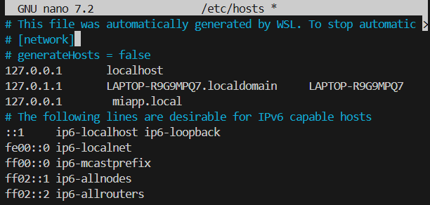

**Se ejecuto este comando:** sudo nano /etc/hosts  y se agrego 127.0.0.1   miapp.local 
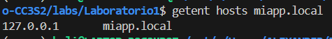

**Se ejecuto este comando:**dig example.com A +ttlunits
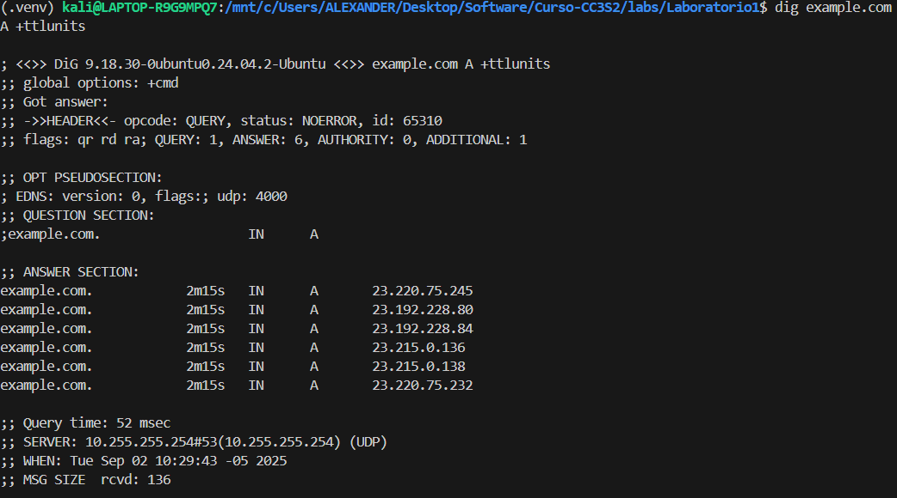
El TTL en DNS indica cuánto tiempo una respuesta puede mantenerse en caché: si consultas repetidamente antes de que expire, el resolver devuelve la copia y el TTL baja; cuando llega a cero, se consulta otra vez al servidor y el TTL se reinicia.

**Pregunta Guia:**
El archivo /etc/hosts es una lista local que mapea nombres a IPs y solo funciona en tu máquina, sin necesidad de un servidor DNS. En cambio, una zona DNS autoritativa es gestionada por un servidor y resuelve nombres de dominio para todo el mundo. El hosts es útil en laboratorio porque te permite simular dominios (ej. miapp.local) rápido y sin montar infraestructura de DNS.

## TLS: seguridad en tránsito con Nginx como reverse proxy

**Se ejecuto este comando:** make tls-cert 
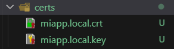
1. miapp.local.key → tu clave privada. Se guarda en secreto en el servidor, y se usa para cifrar y firmar comunicaciones.
2. miapp.local.crt → tu certificado. Contiene la clave pública y la identidad del dominio (miapp.local). Los clientes lo usan para verificar que hablan con el servidor correcto.
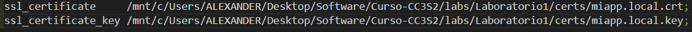
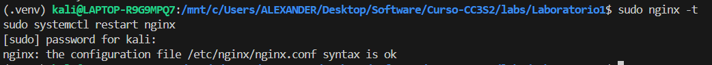
1. El archivo de configuración de nginx no tiene errores de sintaxis.
2. Nginx reconoce bien las rutas que pusiste para los certificados.

**Valida el handshake:**

**Se ejecuto:** openssl s_client -connect miapp.local:443 -servername miapp.local -brief
1. CONNECTION ESTABLISHED → la conexión se hizo bien.
2. Protocol version: TLSv1.3 → se negoció TLS 1.3 (seguro y moderno).
3. Ciphersuite: TLS_AES_256_GCM_SHA384 → algoritmo de cifrado fuerte.
4. Peer certificate: CN = miapp.local → el certificado corresponde a tu dominio local.
5. Verification error: self-signed certificate → esto es normal porque tu certificado es autofirmado (no emitido por una CA como Let’s Encrypt).

**curl -k https://miapp.local/**

**{"message":"Hola","port":8080,"release":"v0","status":"ok"}**
El -k sirve porque tu certificado es autofirmado.

**Puertos y logs:**
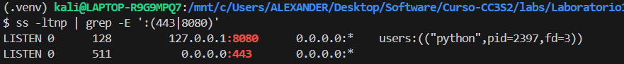

**Se ejecuto:**ss -ltnp | grep -E ':(443|8080)'
-127.0.0.1:8080 → tu app Flask (app.py) está corriendo en localhost, puerto 8080.
-users:(("python",pid=2397,...)) → el proceso es Python (el que corre Flask).
-0.0.0.0:443 → Nginx está escuchando en el puerto 443 en todas las interfaces.

**Se ejecuto:** journalctl -u nginx -n 50 --no-pager
Salio:-- No entries --
Eso significa que nginx no ha registrado ningún log en el journal de systemd.

## 12-Factor App: port binding, configuración y logs

**Ejecucion 1**
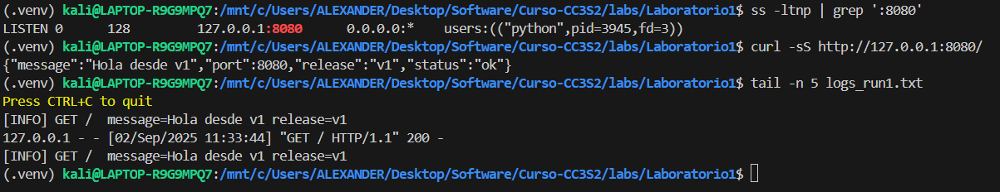

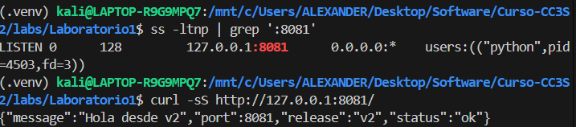

-Port binding → la app no tiene un puerto fijo, sino que se enlaza al valor de la variable de entorno PORT. Así se puede ejecutar en 8080, 8081, etc., sin tocar el código.

-Configuración por entorno → valores como MESSAGE y RELEASE se leen desde variables de entorno. Cambiar su valor modifica la respuesta JSON de la app sin necesidad de reprogramar.

-Logs a stdout → en lugar de escribir en un archivo interno, la app imprime eventos a stdout. Luego el sistema redirige esos logs según se necesite.