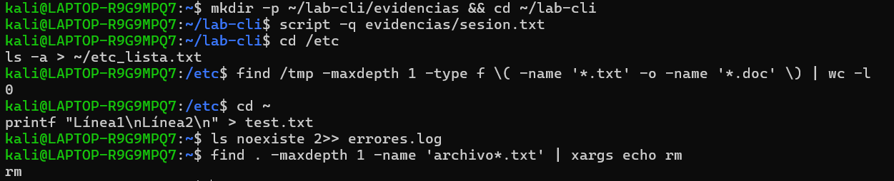
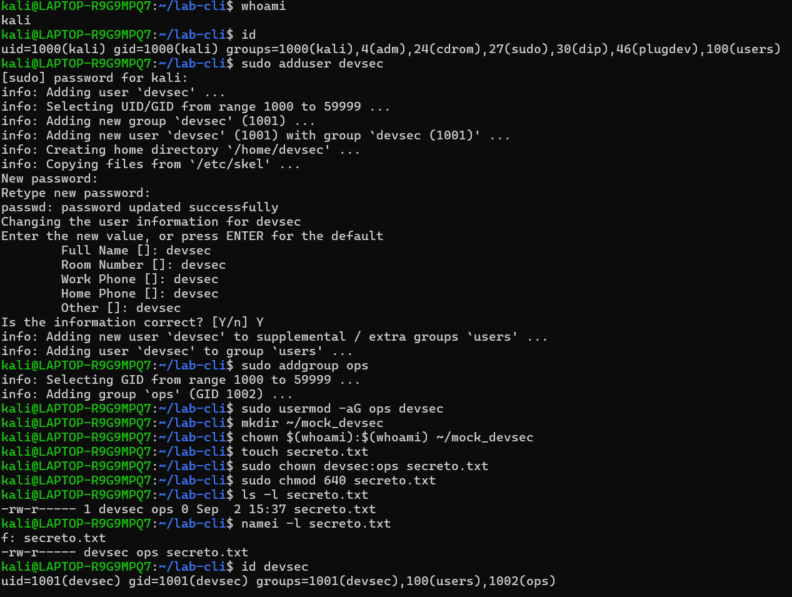

## Sección 1: Manejo sólido de CLI

### Ejercicios de reforzamiento

1.**Navegación y redirección**:cd /etc; ls -a > ~/etc_lista.txt

-cd /etc: Cambia al directorio /etc (donde están configuraciones del sistema)

-ls -a: Lista TODOS los archivos, incluyendo los ocultos (que empiezan con .)

-~/etc_lista.txt: Redirige la salida al archivo etc_lista.txt en tu home

Resultado: Tendrás un archivo con la lista completa de /etc

2.**Globbing y conteo**:find /tmp -maxdepth 1 -type f \( -name '*.txt' -o -name '*.doc' \) | wc -l

-find /tmp: Busca en el directorio /tmp

-maxdepth 1: Solo busca en el primer nivel (no subdirectorios)

-type f: Solo archivos regulares (no directorios)

-name '*.txt' -o -name '*.doc': Archivos que terminen en .txt O .doc

-| wc -l: Cuenta las líneas (número de archivos encontrados)

3.**Crear archivo con printf**:printf "Línea1\nLínea2\n" > test.txt

-printf: Crea texto formateado

-"Línea1\nLínea2\n": Texto con dos líneas (\n = salto de línea)

-test.txt: Crea el archivo test.txt con ese contenido

4.**Manejo de errores**: ls noexiste 2>> errores.log

-ls noexiste: Intenta listar un archivo que no existe (generará error)

-2>> errores.log: Redirige solo los errores (stderr) y los agrega al final del archivo

5.**Borrado seguro con dry-run**: find . -maxdepth 1 -name 'archivo*.txt' | xargs echo rm

-find . -maxdepth 1 -name 'archivo*.txt': Encuentra archivos que coincidan con el patrón

-| xargs echo rm: Solo muestra qué archivos se borrarían (dry-run)

6.**Comprobación con nl**: nl test.txt

-nl: Numera las líneas de un archivo

7.**Conteo de líneas con wc**:wc -l lista.txt
-wc -l: Cuenta las líneas de un archivo

-Resultado: Muestra cuántas líneas tiene lista.txt

## Sección 2: Administración básica 

1.**Gestión de usuarios y grupos:**

sudo adduser devsec       

sudo addgroup ops           

sudo usermod -aG ops devsec 

2.**Permisos de archivos:**

touch secreto.txt                   

sudo chown devsec:ops secreto.txt  

sudo chmod 640 secreto.txt         

ls -l secreto.txt                 

3.**Verificación de permisos:**

namei -l secreto.txt  

id devsec           

4.**Gestión de procesos:**

ps aux | grep bash    

sleep 100 &           

ps aux | grep sleep   

kill 477              

5.**Gestión de servicios:**

systemctl status systemd-logind    

journalctl -u systemd-logind -n 10

6.**Umask:**

umask 027  # Establecer máscara de permisos por defecto

## Sección 3: Utilidades de texto de Unix

1.**grep para buscar "root" en /etc/passwd**
grep root /etc/passwd

-Funcion: Busca la palabra "root" en el archivo /etc/passwd

-Resultado: Muestra todas las líneas que contienen "root"

2.**sed para sustituir texto**
sed 's/dato1/secreto/' datos.txt > nuevo.txt

-Funcion: Reemplaza "dato1" por "secreto" en el archivo

-s/: Sustitución | >: Redirección a nuevo archivo

3.**awk para extraer usuarios**
awk -F: '{print $1}' /etc/passwd | sort | uniq > usuarios.txt

-Funcion: Extrae solo la primera columna (usuarios) de /etc/passwd

-F:: Usa ":" como separador | {print $1}: Imprime primer campo

4.**tr para convertir a mayúsculas + tee**
printf "hola\n" | tr 'a-z' 'A-Z' | tee mayus.txt

-Funcion: Convierte minúsculas a MAYÚSCULAS

-Transformación: hola → HOLA

5.**find para archivos recientes en /tmp**
find /tmp -mtime -5 -type f

-Funcion: Busca archivos en /tmp modificados en los últimos 5 días

-mtime -5: Últimos 5 días | -type f: Solo archivos

6.**Pipeline completo con conteo**
ls /etc | grep conf | sort | tee lista_conf.txt | wc -l

sort: Ordena alfabéticamente

7.**Auditoría con grep y tee**
grep -Ei 'error|fail' evidencias/sesion.txt | tee evidencias/hallazgos.txt

8.**Comprobaciones finales**
file lista_conf.txt && head lista_conf.txt

cat mayus.txt

cat usuarios.txt  

cat nuevo.txt

-Funcion: Identifica el tipo de archivo

-Resultado: "ASCII text" (archivo de texto)